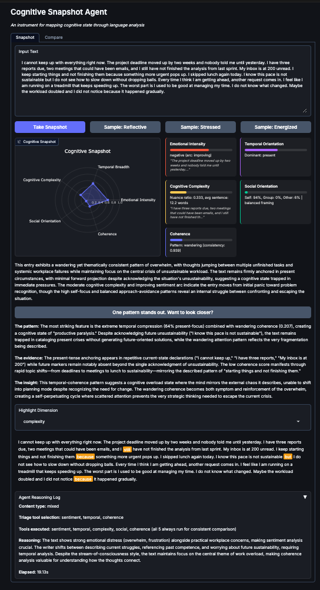
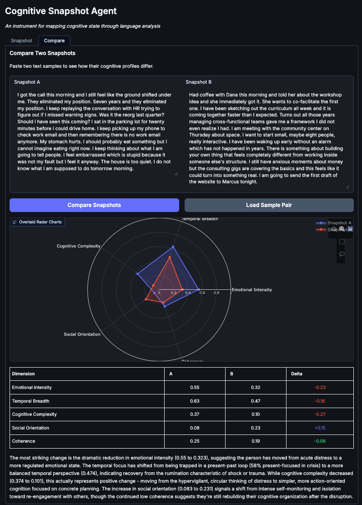
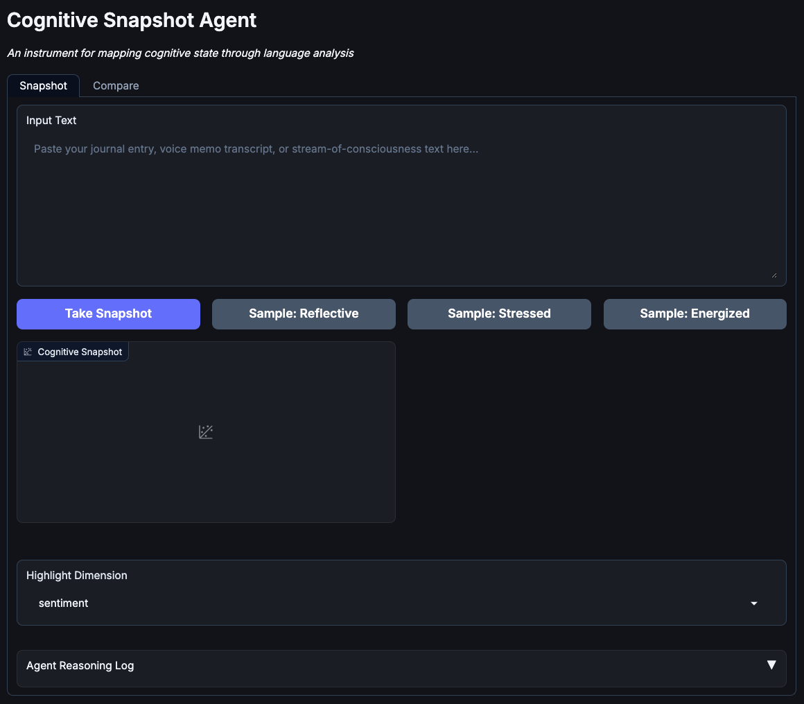

# Cognitive Snapshot

Stream-of-consciousness language carries more information than we give it credit for. We polish the mess out of everything we write for clarity's sake — but the mess is the signal. Read a raw transcript of anyone talking, even the most articulate person you know, and they sound unhinged; in person you'd never notice, because everything else about a human is doing so much work. I built this because I suspected the mess could be imaged — that how a mind wanders, hedges, and loops, down to its smallest function words, is a kind of brain scan taken through language. Pennebaker's research says the invisible words carry the signal. This agent takes that literally.

Language as fMRI. Paste a stream-of-consciousness entry (journal, voice-memo transcript, anything unedited) and the agent runs five empirically grounded instruments over it, then synthesizes a structured cognitive profile: a radar map, dimension cards, color-coded annotated text, and a narrative read of your state of mind.

Built as the final project for a graduate-level AI engineering course (Spring 2026).

**Where it's headed:** this project planted the seed for *Meander* — a living visual instrument on [rodrigocolin.com](http://rodrigocolin.com) that renders months of my own stream-of-consciousness journaling as an evolving river: entries are the water, passing through; the enduring patterns are the channel they've carved. This repo remains the standalone agent — one entry in, one profile out.

## What it looks like

A single entry's profile: a radar across the five dimensions, per-dimension cards, a synthesized read of the state of mind, and the entry re-rendered with its function words highlighted.



Compare mode: two entries overlaid, with a per-dimension delta and a narrative of what shifted between them.



The entry point: paste any raw text, or load a sample.



## The five instruments

| Instrument | What it measures | Method |
|-----------|-----------------|--------|
| Sentiment & emotional tone | Emotional valence and arc | RoBERTa (Cardiff NLP) |
| Temporal orientation | Past / present / future focus | POS tagging + marker words |
| Cognitive complexity | Reasoning sophistication | Suedfeld/Tetlock integrative-complexity markers |
| Self vs. social reference | Pronoun distribution, approach/avoidance | Pennebaker pronoun framework |
| Coherence & fragmentation | Topic consistency under load | Sentence-transformers (MiniLM) cosine similarity |

## Architecture

```
Input → Triage (Claude) → Tool selection → Local analysis (5 tools) → Synthesis (Claude) → Visual output
```

Analysis tools run locally on-device (no GPU required). Triage and narrative synthesis call the Anthropic API.

## Setup

```bash
git clone git@github.com:colin-systems/cognitive-snapshot.git
cd cognitive-snapshot
python3 -m venv venv && source venv/bin/activate
pip install -r requirements.txt
python -m spacy download en_core_web_sm
cp .env.example .env   # add your ANTHROPIC_API_KEY here — never commit .env
```

## Run

```bash
python -m ui.app                  # Gradio UI
jupyter notebook notebook.ipynb   # submission / presentation notebook
```

## Empirical grounding

- **Pennebaker** — James Pennebaker found that the smallest, most overlooked words (pronouns, articles, prepositions) track psychological state more reliably than the topics we consciously choose, predicting outcomes from depression to deception to who holds power in a conversation (*The Secret Life of Pronouns*).
- **Suedfeld & Tetlock** — their integrative-complexity coding showed that the structure of reasoning, how many perspectives a person differentiates and then integrates, measurably contracts under stress and drops in leaders' rhetoric in the months before wars begin.
- **Discourse coherence** — research on semantic cohesion finds that the linkage between one sentence and the next loosens under cognitive load and emotional strain, making the drift between successive thoughts a signal in its own right.
